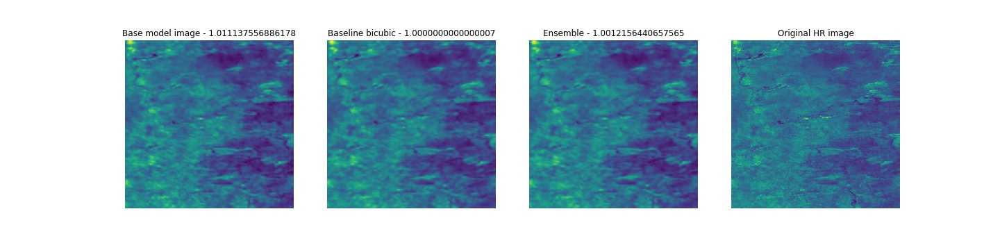
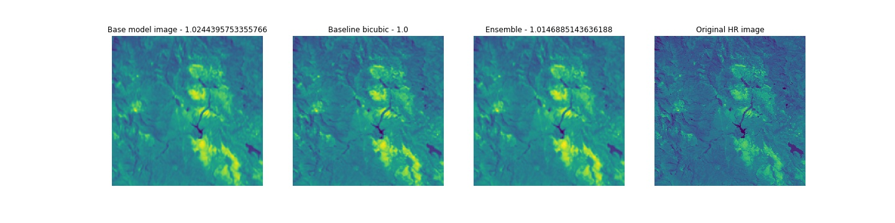
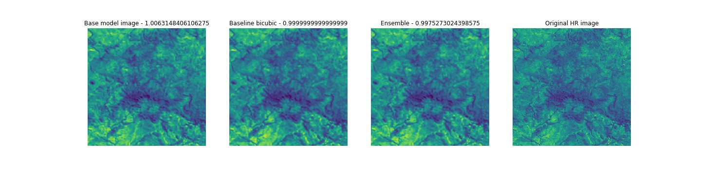

# Probav Super Resolution Competition

## Overview
The Probav Super Resolution Competition can be found [here](https://kelvins.esa.int/proba-v-super-resolution/).

The main idea of this competition is to take a time series of low resolution shots and improve the resolution with respect to an image shot at a higher resolution.

The images are satellite shots taken at distance of 100m per pixel and 300m per pixel.

## My model
My model is a variation on the SRGAN used in this same competition that can be found [here](https://github.com/ENNAJIHYassin/Proba-V).

Instead of training the model as a GAN I wanted to show that the model can be trained without a discriminator, with less layers, and less filters.  The results can be seen in the table below (lower is better).

| Model Name                     | Performance        | Change  |
|--------------------------------|--------------------|---------|
| SRGAN (Original)               | 0.996171889447587  |         |
| This model                     | 0.996755484774893  | +0.0006 |
| This model + baseline ensemble | 0.991985511236378  | -0.005  |

The model + baseline ensemble takes the result and averages it with the baseline of the competition which was a bicubic interpolation from the low resolution size to the high resolution size.

I have posted the above model to [dropbox](https://www.dropbox.com/s/ney8pm5hmj6i1j4/inference_306.pt?dl=0).

The structure of the model can be found in 'resnet_test.py'

## Conclusions

It can be seen that the original SRGAN model can definitely be improved upon.  GANs can be somewhat unstable, that may be one reason for the score not differing significantly between training a discriminator and generator vs just building a standard encoder and decoder pair.  One way the original method could have improved is by using data augmentation.  The original model only used the original samples, which is restricted to about 1000 samples.  However, by flipping and rotating you can generate up to 9000 samples.  This allows the model to generalize more and avoid overfitting.

It should be noted that I actually noticed the score on the training data was __higher__ than the score I saw on the test set.  So the ability to generalize has definitely helped the model.

## Running

I am using the embiggen library that can be found [here](https://github.com/lfsimoes/probav).  It is included in this respository.  I have adjusted the requirements.txt to reflect more properly what was needed.  The scikit-image in that repository is 0.14.2, using newer versions will throw errors in the io module.  I attempted to fix this but ran into more issues.

Please install torch for your corresponding setup from the torch website [here](https://pytorch.org/get-started/locally/).

### Data
Please download and extract the train and test data from [here](https://kelvins.esa.int/proba-v-super-resolution/data/) and place it in the main directory as probav_data.

### Train
To train please run train.py.  

You can modify the parameters in there as you feel necessary.  BATCH_SIZE is probably the only thing you'll need to modify yourself.  All parameters and hyperparameters in the file are exactly as I trained the model.  However, I did ultimately only train 500 epoch's and select the best from there.  train.py is currently configured to go 2000 epochs.  You can train for that long if you like, but it seemed as if it started to be fully converged at around 300 epoch's.

Most notably you can turn previews to True to see image previews every x iterations.

The outputs are a state_dict that can be used a checkpoint if you wish, as well as after every epoch I output the model to an inference_[epoch].pt

### Test
predict.py contains functions that will allow you to test on training data and see the scores in relation to the baseline.  It also contains a method to let you iterate through inference models and test each one so you can compare and find the best performing.  You can also limit the testing to n number of train samples.

### Prepare submission
prepare_result.py takes in the model you would like to use and creates the prepared submission using the embiggen methods.  There is an option to ensemble with the bicubic interpolation result.  This has shown to improve results in this model, so it is recommended to be used.

### Notebook
I have a notebook titled 'Results review' which will step by step go through the generation of the below results images.  I also have a second one 'Scoring' which reviews the scoring process for this competition, as well as takes a slightly closer look at the data.

## Possible improvements
The network may further improve by utilizing more data augmentation and more epochs.  Some of the other competitors further broke images down from 128,128 images to 4 64,64 images and ran them that way.  I think it could definitely benefit here, but as mentioned above there wasn't an overfitting problem so the results may be minimal.  The other thing is I'm using a standard interpolate function to resize in the decoder from 128,128 to 384,384.  I had originally used a ConvTranspose2d, but I was getting a lot of artifacts that were not being removed.  I think with more data and more epoch's this could be resolved and would potentially make the result better.

Another option would be to train the encoder to match a resized version of the high resolution image, and then training the decoder on the full size high resolution image.  This would allow us to make sure we have robust encoder before training the decoder, as opposed to training both at the same time.

Finally, separating the datasets into the NIR and RED lightbands and training different networks may also see an increase in score.  I opted not to do this as it takes me long enough just to train one model, and two models with half the data I currently have was going to eat up a lot of time.

## Results

## References
[Probav dataset](https://github.com/lfsimoes/probav)

[Probav dataset paper](https://arxiv.org/abs/1907.01821)

[Original SRGAN for probav dataset](https://github.com/ENNAJIHYassin/Proba-V)

[DeepSum](https://arxiv.org/abs/1907.06490) - Competition winner

[HighRes-Net](https://github.com/ElementAI/HighRes-net) - Runner up

[Embiggen wrapper for probav dataset](https://github.com/lfsimoes/probav)